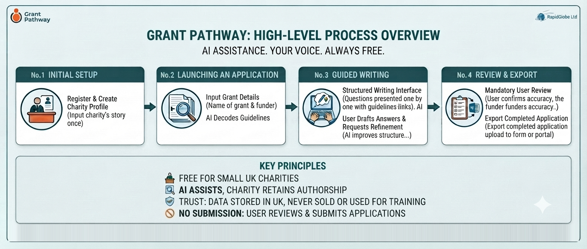

# Business Overview

_The service provided by RapidGlobe Ltd_

**31 July 2026**
_Version 1.17_

---

## Why Grant Pathway Exists

Every year, thousands of UK charities miss out on funding they deserve — not because their work isn't good enough, but because writing a strong grant application is hard, time-consuming, and often falls to someone who has never been trained to do it.

Grant Pathway is a free online tool that helps charities write better grant applications. It uses artificial intelligence to read funder guidelines and produce a plain-English summary of what the funder is looking for. The charity worker then writes their own answers to each application question, in their own voice. AI assistance is available on request — to help with structure, clarity, and expression — but every word of the final application belongs to the charity. The charity is always the author. AI is never requested to generate the answers.

**It is completely free. No subscription. No trial period. No catch.**

## The Problem We Are Solving

Picture a volunteer at a small community charity. She gives two days a week of her time, coordinating other volunteers, running a weekly social group for isolated older adults, managing the charity's social media — and writing grant applications. She has no fundraising training. When a grant deadline arrives, she clears her diary for the weekend, downloads a twenty-page PDF of funder guidelines, and starts writing from scratch.

She finds the language confusing. Terms like "theory of change", "additionality", and "outcomes framework" were not designed for someone who simply wants to help people in her community. She refers to old applications, copies what she can, rewrites the rest, and submits something she is never quite sure about. Two to three days of her life, every time.

Now picture a charity manager at a youth services organisation. He writes ten or twelve applications a year — always in the evenings or at weekends, because there is no one else to do it and the charity cannot afford a professional fundraiser. He knows his applications could be stronger. He simply does not have the time to make them so.

These are not unusual situations. They are the everyday reality for the majority of UK charities. Smaller organisations — the ones doing vital work in communities across the country — are competing for funding against charities with dedicated fundraising teams and polished professional applications. The playing field is not level.

There is no shortage of goodwill, capability, or impact in the small charity sector. What is in short supply is time, confidence, and access to the kind of writing support that larger organisations take for granted.

**Grant Pathway exists to change that.**

## What Grant Pathway Does

Grant Pathway is a writing companion. It does not find grants for charities. It does not decide which grants to apply for. It does not submit applications on anyone's behalf. What it does is take the hardest, most time-consuming part of the writing process — understanding what a funder is looking for — and make it significantly easier.

Here is how a typical session works.

A charity worker registers for a free account and sets up a profile for their organisation. They describe who they are, what they do, who they help, and where they work. If they have a charity registration number, Grant Pathway can look it up on the public register of charities for England and Wales and fill in some of those details for them, to save re-typing what is already a matter of public record. They only do this once. From that point on, Grant Pathway remembers their story.

When they are ready to work on an application, they create a new entry — just the name of the grant and the funder. If they have used Grant Pathway before, they can start from one of their own earlier applications rather than from a blank page. They then paste in or upload the funder's guidelines: the document that explains what the funder is looking for, what the application questions are, and what kind of evidence is expected.

Grant Pathway reads those guidelines and produces a plain-English summary. Not a copy of the document — a clear, straightforward explanation of what the funder cares about, what each question is really asking, and what a good answer might look like. For someone who finds funder language intimidating, this alone can be transformative.

The summary also covers who the funder will and will not fund. If the guidelines make it clear that the charity is not eligible for this particular grant, Grant Pathway says so at that point and does not take the application any further. Knowing in five minutes is worth a great deal more than finding out after a weekend of writing.

Grant Pathway then presents the application questions one by one, in a structured writing interface. Each question links back to the relevant section of the funder's original guidelines, so the charity worker can easily cross-reference what the funder has asked for. The charity worker writes their own answer to each question in their own words. If they want help with structure, flow, or expression, they can ask Grant Pathway to suggest improvements — but the AI refines what they have written; it does not write for them.

Before any answer becomes part of the application, the person using the tool must review it. Grant Pathway asks three simple questions: Does this accurately describe your charity and project? Are all the figures, dates, and facts correct? Does this answer the question that was asked? Only once the user has considered these questions and given their approval is the answer treated as done. The charity worker is always the author. Grant Pathway is always the assistant.

When the application is complete, the charity worker can export everything as a clean Word document, ready to copy into a funder's application form or online portal.

## What Grant Pathway Does Not Do

It is just as important to be clear about what Grant Pathway does not do.

**It does not find grants.** Charities need to have already identified the grant they wish to apply for. Grant Pathway is a writing tool, not a search engine.

**It does not guarantee funding.** Using Grant Pathway will not ensure an application is successful. It helps charities express their work more clearly and consistently, but funding decisions rest entirely with the funder.

**It does not submit applications.** Nothing is ever sent to a funder on the charity's behalf. The charity worker reviews, approves, and submits their own application in their own way.

**It does not write for you.** The charity writes every answer in their own voice. AI assistance is available on request to improve structure and clarity — but it works with what the charity has written, not instead of it. The responsibility for every word of the application rests with the charity, not the tool.

**It is not a replacement for human expertise.** For charities that have access to a professional fundraiser, Grant Pathway can complement their work. For those that do not, it provides meaningful support where there was previously none.

## Who It Is For

Grant Pathway is designed for small and mid-size UK charities — broadly, those with an annual income of up to around £1 million — where grant writing falls to someone who is not a professional fundraiser.

That might be a trustee or volunteer who gives a few days a week. It might be a charity manager whose job description does not include fundraising, but who ends up doing it anyway. It might be a part-time administrator who has been asked to take on something new. What these people share is not a lack of commitment or intelligence — it is a lack of dedicated time, specialist training, and the kind of institutional support that larger charities enjoy.

Grant Pathway is built around their reality. It is designed to be straightforward enough for someone who has never used an AI tool before and genuinely useful for someone who writes either a few or many applications a year. It does not require technical knowledge. It does not assume any prior experience with grant writing. It asks only that the person using it knows their own organisation — and they always do.

## Why It Is Free

Grant Pathway is free because the problem it solves is most acute in organisations that cannot afford to pay for it.

A subscription fee — however small — would immediately exclude the smallest charities, the volunteers, and the community groups that need the most support. A freemium model would create a two-tier system where better tools are available to those with more money. Neither outcome is consistent with why the tool exists.

The running costs of Grant Pathway are absorbed personally by the developer during the initial period. The longer-term plan is to establish a Community Interest Company (CIC) — a social enterprise with a legal commitment to public benefit — and seek operational funding from organisations in the charity sector infrastructure, such as technology funders and digital inclusion programmes. That funding will sustain the free service for everyone who needs it.

There is no advertising. There is no data selling. The service exists to serve charities, and it will remain free.

The AI-powered features operate within a fair-use limit per account each month. This is a technical necessity to manage running costs — not a commercial restriction or a hidden tier. The limit is designed to accommodate the realistic needs of a small charity writing grant applications throughout the year, and the current figure is stated in the Terms of Service.

## Data, Privacy, and Trust

Charities trust us with information about their organisation, their work, and their communities. That trust is taken seriously.

The charity's own content — their organisation profile, the funder guidelines they upload, and the answers they write — is held in UK-based infrastructure in London. The AI processing that produces the funder summary and suggests improvements also takes place in the UK, and never outside the European Economic Area under any circumstances. A small number of supporting services sit outside the UK — website hosting, transactional email, and error monitoring — and each is covered by the safeguards UK data protection law requires. Every provider is named in the Privacy Policy, along with where it is based and what it does.

The charity's information is used only to provide the service — to personalise the AI outputs and save time on future applications. It is never used to train artificial intelligence models. It is never shared with third parties for commercial purposes.

Users can delete their account and all associated data at any time. Deletion is immediate and permanent in the live service; routine backup copies are removed within seven days as part of the standard backup cycle, and are never accessible to users or used to restore deleted content.

Accounts that have not been used for two years are automatically deleted, with a warning email sent approximately 30 days in advance. This is a deliberate data minimisation commitment — the service does not retain information beyond what is needed, and users are given fair notice before anything is removed.

The Privacy Policy and Terms of Service set all of this out in full, in plain English, and can be read before anyone is asked to register.

## The People Behind It

Grant Pathway is being provided by RapidGlobe Ltd, a company based in the UK, motivated by a straightforward belief: that the quality of a charity's grant application should not depend on the size of its fundraising budget.

The intention is to donate the tool to the charity sector through a Community Interest Company (CIC) — a legal structure that permanently locks the asset for public benefit and prevents it from ever being sold for private gain.

## Where We Are Heading

Version 1 of Grant Pathway focuses entirely on writing. It is deliberately focused — doing one thing well, for the people who need it most.

Future development will be shaped by the people who use the tool. Ideas already being considered include tracking applications and deadlines, and supporting post-award reporting. Helping charities find grants in the first place is not among them — Grant Pathway is, and will remain, a writing tool. None of this is promised. All of it will be considered in conversation with the charities Grant Pathway is built to serve.

The ambition is simple: to make the grant application process a little less daunting, a little less time-consuming, and a little fairer — for every charity in the UK that is doing good work and deserves the chance to fund it.

---

_Free for UK charities · [grantpathway.org.uk](https://grantpathway.org.uk)_
